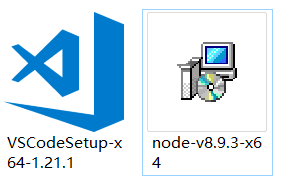
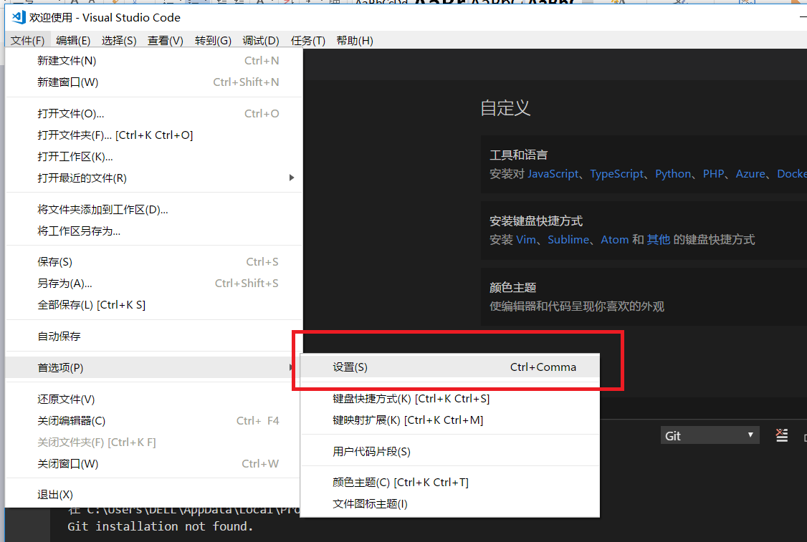
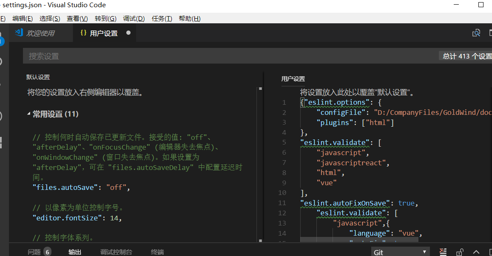
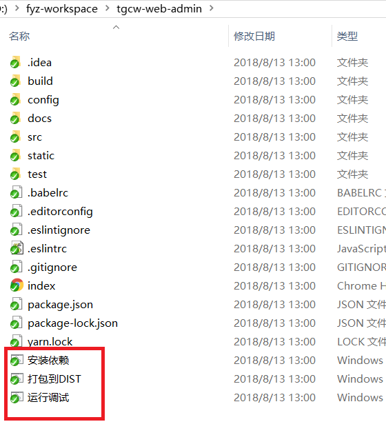

# VUE开发工具配置


  
1. **代码开发工具的配置**

### 1.1. **开发环境安装**

安装VSCodeSetup-x 64-1.21.1版本和node-v8.9.3-x64版本

### 1.2. **Vue安装**

    1） 安装cnpm

           在命令行中输入  npm install -g cnpm --registry=http://registry.npm.taobao.org  ，然后等待，没报错表示安装成功，（我的已经安装过了，显示更新成功的信息）

       完成之后，我们就可以用cnpm代替npm来安装依赖包了。如果想进一步了解cnpm的，查看淘宝npm镜像官网。

     2） 安装vue-cli 脚手架构建工具

在命令行中运行命令 cnpm install -g vue-cli ，然后等待安装完成。

### 1.3. **配置开发工具**

1、打开文件-首选项-设置

2、在用户设置内填写一下内容，并且设置.eslintrc.js路径

{"eslint.options": {

    "configFile": "D:/CompanyFiles/GoldWind/doc/goldwind/vue/.eslintrc.js",

    "plugins": \["html"\]

},

"eslint.validate": \[

    "javascript",

    "javascriptreact",

    "html",

    "vue"

\],

"eslint.autoFixOnSave": true,

    "eslint.validate": \[

        "javascript",{

            "language": "vue",

            "autoFix": true

        },"html",

        "vue"

    \],

"vetur.format.defaultFormatter.html": "js-beautify-html"

}

3、.eslintrc.js的文件内容是

module.exports = {

  root: true,

  parser: 'babel-eslint',

  parserOptions: {

    sourceType: 'module'

  },

  // https://github.com/feross/standard/blob/master/RULES.md\#javascript-standard-style

  extends: 'standard',

  // required to lint \*.vue files

  plugins: \[

    'html'

  \],

  // add your custom rules here

  'rules': {

    // allow paren-less arrow functions

    'arrow-parens': 0,

    // allow async-await

    'generator-star-spacing': 0,

    // allow debugger during development

    'no-debugger': process.env.NODE\_ENV === 'production' ? 2 : 0,

    // allow undefined variable

    'no-undef' :0

  }

}

### 1.4. **项目启动**

从SVN下载项目后，里面有三个批处理文件

1、安装依赖

系统会根据package.json下载依赖包

2、打包到DIST

打包项目为html静态页面，结果在DIST文件夹下面

3、运行调试

双击后即可启动项目

